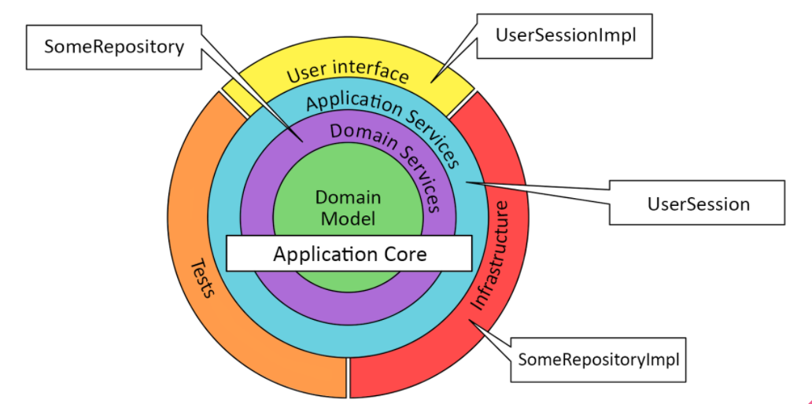
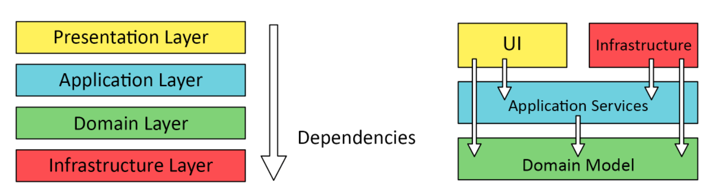
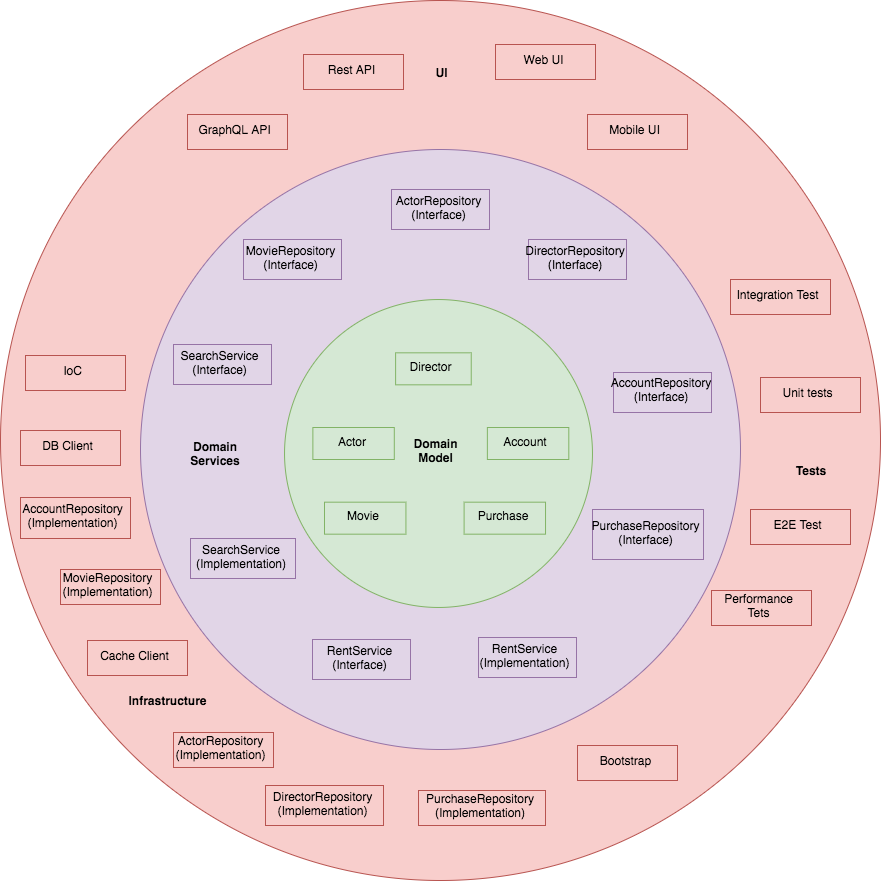

# Demo 3 @ Node.js Madrid Meetup

## Acerca de este ejemplo

Este ejemplo es parte de una presentación que tuvo lugar en
el meetup de Node.js de Madrid. Las diapositivas de la presentación se puede encontrar [aquí](https://docs.google.com/presentation/d/12hK5z0wt4BlyOFhJBxVgQBTdvwTznKj3XttlvMwYgrY/present).

Este ejemplo demuestra cómo integrar InversifyJS con Express y como implementar aplicaciones que se adhieren a la arquitectura cebolla. Esta arquitectura de capas puede representarse en un diagrama como sigue:



La principal diferencia entre una arquitectura de n-capas tradicional y la arquitectura cebolla es la dirección de las dependencias entre capas.

En la arquitectura cebolla aplicamos el principio de inversión de dependencias. Los detalles de la implementación (infraestructura) depende de las abstracciones (dominio):



La siguiente lista describe el propósito de una de las capas
nn la arquitectura cebolla:

- **Servicios de dominio** - Servicios que existen para reforzar la integridad del dominio y facilitar la inserción, creación, eliminación y recuperación de datos. A menudo, son fachadas encima de repositorios, trabajando para esconder parte de la implementación de bajo nivel y para proporcionar una interfaz más en línea con el UL (lenguaje omnipresente).

- **Servicios de aplicacion** - Servicios que son específicos a la implementación de un modelo del dominio o que no tienen dependencia en el modelo del dominio. Un ejemplo clásico de esto sería el envío y el correo electrónico basado en un cambio de estado o una acción en el dominio. Esto suele ser un requisito de la propia aplicación, y es probable que no esté especificado por el modelo de dominio.

- **Servicios de Infraestructura** - Son servicios que hablan con recursos externos y no son parte del dominio principal del problema. Los ejemplos comunes que veo para esto son correo electrónico y registro.

Esta demostración implementa una API REST de una tienda en linea de películas como ejemplo. La estructura de las carpetas puede parecer un poco confusa de primeras por lo que es recomendable analizar el siguiente diagrama y compararlo con la estructura de directorios para entender la demostración con mayor facilidad:



Las capas del exterior contienes más detalles (implementaciones) que las capas del interior (abstracciones). Las capas del exterior dependen de las capas del interior pero no al contrario.

Puedes obtener más información sobre la arquitectura cebolla [aquí](https://dzone.com/articles/onion-architecture-is-interesting).

## Como ejecutar este ejemplo

> :warning: **Importante** Para seguir las instrucciones a continuación, es necesario instalar [Docker](https://docs.docker.com/engine/installation/) y [Docker Compose](https://docs.docker.com/compose/install/).

Puedes utilizar los siguientes comandos para clonar y ejecutar este ejemplo:

```sh
git clone https://github.com/stelltec/public-tech-demos.git
```

```sh
cd public-tech-demos/nodejs-madrid-meetup/demo3/
```

```sh
npm install
```

```sh
npm install -g typescript
```

```sh
npm start
```
